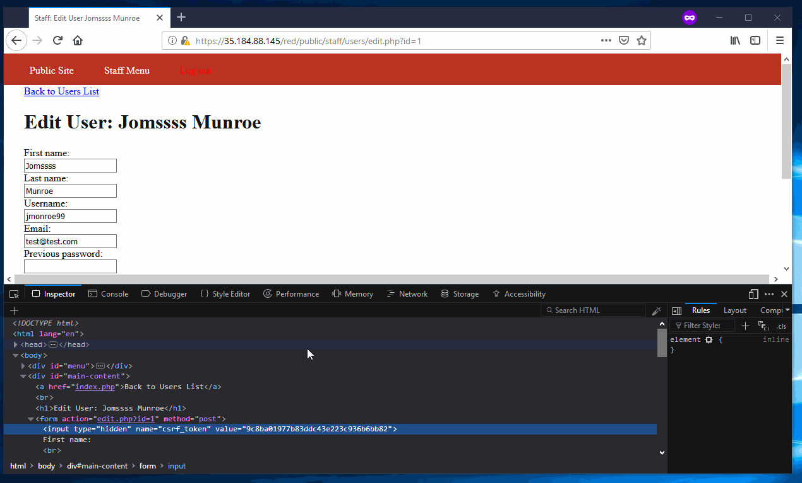

# Project 8 - Pentesting Live Targets

Time spent: **7** hours spent in total

> Objective: Identify vulnerabilities in three different versions of the Globitek website: blue, green, and red.

The six possible exploits are:
* Username Enumeration
* Insecure Direct Object Reference (IDOR)
* SQL Injection (SQLi)
* Cross-Site Scripting (XSS)
* Cross-Site Request Forgery (CSRF)
* Session Hijacking/Fixation

Each version of the site has been given two of the six vulnerabilities. (In other words, all six of the exploits should be assignable to one of the sites.)

## Blue

Vulnerability #1: SQL Injection\
This is done by going to /blue/public/salesperson.php?id=1 and replacing the 1 with an SQL injection like: ' OR SLEEP(5)=0--'

Vulnerability #2: Session Hijacking/Fixation\
This can be seen quite easily by logging in/out and noticing that the PHPSESSID cookie does not change.

## Green

Vulnerability #1: XSS\
This works because HTML is not escaped when feedback is presented to staff on the /green/public/staff/feedback/index.php page. This lets malicious users use a <script> tag in order to gain full JavaScript execution.

Vulnerability #2: See note at the bottom. All 3 websites have a user enumeration vulnerability.

## Red

Vulnerability #1: IDOR\
Salesmen IDs which are no longer in use can still be viewed if manually set. For example, going to /red/public/salesperson.php?id=10 provides access to private information.

Vulnerability #2: CSRF\
The CSRF tokens generated for submissions to /red/public/staff/users/edit.php?id=ID are not used. This allows attackers to create auto-submitting forms that force admins to submit changes to this endpoint. This would allow an attacker to change a user's name.

## Notes

All 3 colors exhibit a fairly simple user enumeration flaw. This confused me a lot and caused the project to take a lot longer than it should have.\
This flaw can be demonstrated by viewing the server's response time for attempted logins on any of the 3 sites. For a user which does not exist, the server will always respond in approximately 80ms. However, if the user does exist, the response time will always be greater than 200ms. This is likely a result of how the database queries work. These timings can be viewed in Firefox by going to the Network tab, selecting a request, and then viewing the Timings for that request.
